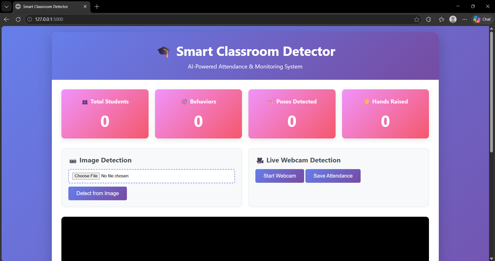
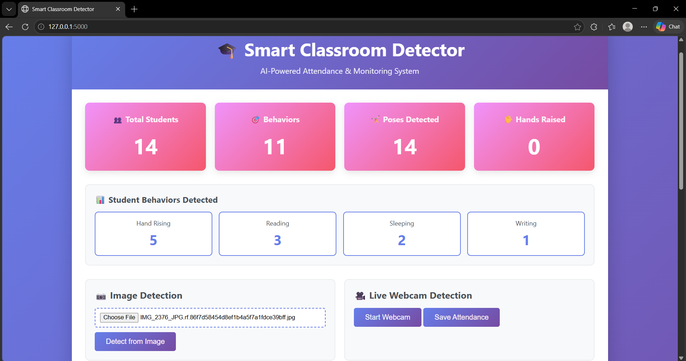
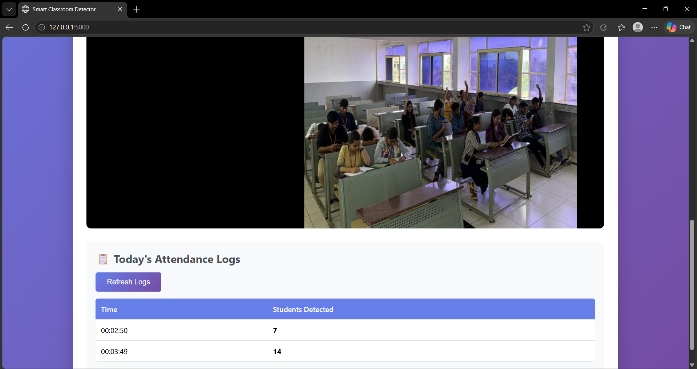

<div align="center">

# 🎓 Smart Classroom Detector

### AI-Powered Classroom Analytics Using Computer Vision & Deep Learning

<p align="center">
  
  
  
  
</p>

<p align="center">
  
  
  
  
</p>

### Detect • Analyze • Monitor • Improve

AI-powered system for automated attendance tracking, student behavior detection, classroom monitoring, and real-time analytics.

</div>

---

# 📖 Overview

Smart Classroom Detector is a Computer Vision-based application designed to automate classroom monitoring using Artificial Intelligence.

The system combines multiple YOLO models, pose estimation techniques, and behavior recognition algorithms to provide real-time classroom insights from images and live webcam feeds.

The goal is to reduce manual classroom management efforts while helping educators understand student engagement and classroom dynamics.

---

# 🚀 Key Features

## 👥 Student Detection & Counting

- Real-time student detection
- Automatic classroom population counting
- Multi-student support
- Accurate classroom occupancy monitoring

---

## 📝 Automated Attendance

- Attendance generation from detected students
- CSV-based attendance storage
- Timestamp logging
- Historical attendance records

---

## 🧠 Classroom Behavior Detection

The system identifies important classroom behaviors:

| Behavior | Purpose |
|-----------|----------|
| ✋ Hand Raising | Measures participation |
| 😴 Sleeping | Detects inattentiveness |
| 📱 Phone Usage | Identifies distractions |
| ✍️ Writing | Tracks note-taking |
| 📖 Reading | Measures engagement |

---

## 🤸 Pose Estimation

- Human keypoint detection
- Hand-raising recognition
- Student posture analysis
- Enhanced activity understanding

---

## 🎭 Instance Segmentation

- Individual student segmentation
- Better object separation
- Improved visualization

---

## 📊 Analytics Dashboard

- Student count visualization
- Behavior distribution analysis
- Attendance statistics
- Real-time classroom insights

---

# 🏗️ System Architecture

```text
               Input Source
          (Image / Webcam Feed)
                       │
                       ▼
        Student Detection Model
                       │
                       ▼
            Pose Estimation
                       │
                       ▼
         Behavior Classification
                       │
                       ▼
         Attendance Generation
                       │
                       ▼
          Analytics Dashboard
                       │
                       ▼
              Final Results
```

---

# 📸 Project Screenshots

## Dashboard



---

## Detection Results



---

## Live Monitoring



---

# 🎯 Detected Behaviors

| Class | Description |
|---------|-------------|
| Hand Raising | Student participation |
| Sleeping | Low attentiveness |
| Phone Usage | Classroom distraction |
| Writing | Active note-taking |
| Reading | Learning engagement |

---

# 📊 Model Performance

## Overall Results

| Metric | Value |
|----------|----------|
| mAP@50 | 82.24% |
| Dataset Size | 1422 Images |
| Classes | 5 |
| Epochs | 50 |

---

## Class-wise Performance

| Class | Precision | Recall | mAP@50 |
|---------|---------|---------|---------|
| Hand Raising | 86.5% | 92.0% | 91.9% |
| Sleeping | 83.1% | 88.3% | 88.9% |
| Phone Usage | 78.8% | 72.4% | 82.0% |
| Writing | 76.4% | 65.9% | 77.4% |
| Reading | 66.2% | 63.9% | 71.0% |

---

# 📂 Dataset Information

## Dataset Statistics

| Category | Count |
|------------|---------|
| Training Images | 1245 |
| Validation Images | 177 |
| Test Images | 177 |
| Total Images | 1422 |

---

## Classes

1. Hand Raising
2. Sleeping
3. Phone Usage
4. Writing
5. Reading

---

# 💻 Technology Stack

## Frontend

- HTML5
- CSS3
- JavaScript

## Backend

- Flask
- Python

## AI / Machine Learning

- Ultralytics YOLO
- PyTorch

## Computer Vision

- OpenCV
- NumPy
- Pillow

## Data Processing

- Pandas
- CSV

## Deployment

- Hugging Face Spaces
- Gunicorn

---

# 📁 Project Structure

```bash
AI-SmartClassroom-Detector/
│
├── app.py
├── yolo_detector.py
├── attendance_logger.py
├── requirements.txt
├── README.md
│
├── templates/
│   └── index.html
│
├── static/
│   ├── css/
│   │   └── style.css
│   │
│   └── js/
│       └── main.js
│
├── models/
│   ├── best.pt
│   ├── yolo_model.pt
│   ├── yolo_pose.pt
│   └── yolo_seg.pt
│
├── attendance_logs/
│
├── img/
│   ├── demo1.png
│   ├── demo2.png
│   └── demo3.png
│
└── dataset/
```

---

# ⚙️ Installation

## Clone Repository

```bash
git clone https://github.com/khushanuma-shabbir/AI-SmartClassroom-Detector.git

cd AI-SmartClassroom-Detector
```

---

## Create Virtual Environment

### Windows

```bash
python -m venv venv

venv\Scripts\activate
```

### Linux / macOS

```bash
python3 -m venv venv

source venv/bin/activate
```

---

## Install Dependencies

```bash
pip install -r requirements.txt
```

---

## Run Application

```bash
python app.py
```

Open browser:

```bash
http://localhost:5000
```

---

# 🎮 Usage

## Image Detection

1. Upload classroom image
2. Click Detect
3. View:
   - Student count
   - Behavior analysis
   - Attendance data
   - Analytics dashboard

---

## Webcam Monitoring

1. Start webcam
2. Allow camera access
3. Monitor classroom live
4. Generate attendance logs
5. Analyze behavior in real-time

---

# 🌍 Real World Applications

### 🏫 Educational Institutions

- Smart attendance systems
- Classroom engagement analysis
- Student participation tracking

### 📈 Academic Analytics

- Learning behavior research
- Student engagement studies
- Classroom performance evaluation

### 🏢 Smart Campus Solutions

- AI-powered monitoring
- Educational automation
- Data-driven decision making

---

# 🔮 Future Improvements

- Multi-camera classroom monitoring
- Cloud database integration
- Mobile application
- REST API support
- LMS integration
- Advanced analytics dashboard
- Teacher notification system
- Face recognition-based attendance
- Predictive student performance analysis

---

# 🌐 Live Demo

### Hugging Face Deployment

Replace with your deployed link:

```text
https://huggingface.co/spaces/your-space-link
```

---

# 👩‍💻 Developer

## Khushanuma Shabbir Mansuri

**B.Tech Information Technology**  
NMIMS University

### Areas of Interest

- Artificial Intelligence
- Machine Learning
- Computer Vision
- Full Stack Development
- Data Analytics

### Connect With Me

**GitHub**

```text
https://github.com/khushanuma-shabbir
```

**LinkedIn**

```text
https://linkedin.com/in/khushanuma-shabbir
```

**Email**

```text
khushanuma.shabbir@gmail.com
```

---

# 📜 License

This project is licensed under the MIT License.

You are free to use, modify, and distribute this project with proper attribution.

---

# 🙏 Acknowledgements

- Ultralytics YOLO
- OpenCV
- PyTorch
- Flask
- Hugging Face Spaces
- Open Source AI Community

---

<div align="center">

### ⭐ If you found this project useful, consider giving it a star.

**Smart Classroom Detector • AI for Education • Computer Vision**

</div>
